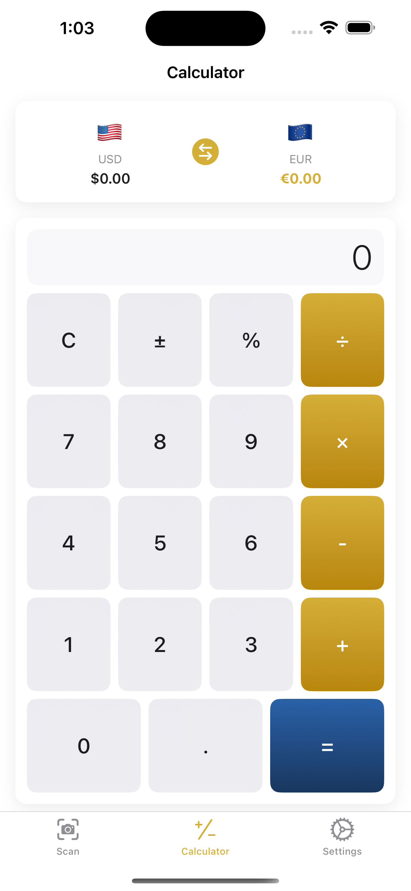
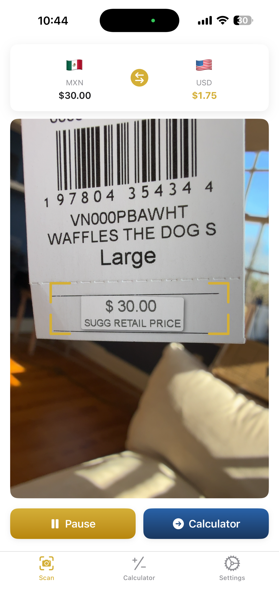

# Real Time Currency Conversion

Convert currencies instantly by pointing your camera at any price tag.

## Screenshots

  
  
  

## Features

### Camera Scanning
- **Point & Convert** - Aim your camera at any price tag or menu and see instant conversions
- **Smart Recognition** - Automatically detects prices and currency symbols in the frame
- **Tap to Select** - Multiple prices visible? Tap the one you want to convert
- **Works Offline** - Exchange rates stored locally - no internet needed while traveling

### Built-in Calculator
- **Quick Calculations** - Full calculator for tips, splitting bills, or custom amounts
- **Live Conversion** - See conversions update as you type
- **Easy Transfer** - Send scanned prices to the calculator with one tap

### 150+ Currencies Supported
USD, EUR, GBP, JPY, CAD, AUD, CHF, CNY, INR, MXN, BRL, KRW, SGD, HKD, NOK, SEK, DKK, NZD, ZAR, NGN, KES, EGP, AED, SAR, THB, PHP, IDR, VND, and many more.

## Perfect For
- International travel and vacations
- Shopping abroad
- Reading foreign menus and price tags
- Comparing prices across countries
- Business travelers
- Digital nomads

## Privacy First
All processing happens on your device. No photos are stored or uploaded. No accounts, no tracking, no data collection. Your camera feed never leaves your phone.

## Requirements
- iOS 16.0+
- iPhone with Neural Engine (iPhone XS or later)

## Links
- [Privacy Policy](https://okekedev.github.io/CoinConvert/privacy.html)
- [Terms of Use](https://okekedev.github.io/CoinConvert/terms.html)
- [Support](https://okekedev.github.io/CoinConvert/support.html)

## License
© 2024 Christian Okeke. All rights reserved.
